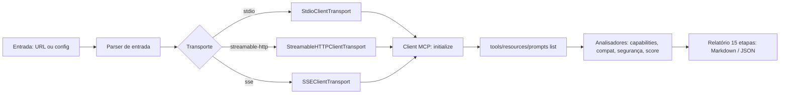

# mcp-inspector

> CLI que **inspeciona servidores MCP (Model Context Protocol) ao vivo** e gera um relatório técnico de **15 etapas** — identificação, ferramentas, resources, prompts, capabilities, compatibilidade, latência, performance, segurança, erros, boas práticas, qualidade de design e **Score Geral**.

Conecta-se a servidores via `stdio`, `sse` ou `streamable-http`, executa `initialize` + `* /list` e produz o relatório em **Markdown** ou **JSON**.

[](https://github.com/n8nfelipe/mcp-inspector/actions/workflows/ci.yml)
[](LICENSE)

## Índice

- [Instalação](#instalação)
- [Uso](#uso)
- [Formatos de entrada](#formatos-de-entrada-aceitos)
- [Exemplo de saída](#exemplo-de-saída)
- [As 15 etapas](#as-15-etapas)
- [Score & Compatibilidade](#score--compatibilidade)
- [Arquitetura](#arquitetura)
- [Scripts](#scripts)
- [Estrutura do projeto](#estrutura-do-projeto)
- [Stack](#stack)
- [Limitações](#limitações)
- [Troubleshooting](#troubleshooting)
- [Licença](#licença)

## Instalação

```bash
pnpm install
pnpm build
```

Para usar globalmente após o build:

```bash
pnpm link --global
mcp-inspector --help
```

> **Nota (ambientes com política de supply-chain do pnpm):** na primeira execução pode ser necessário aprovar os scripts de build do `esbuild` com `pnpm approve-builds`.

## Uso

```bash
# Inspecionar por URL remota (streamable-http ou sse)
mcp-inspector https://meu-servidor.com/mcp

# Inspecionar por configuração local (stdio)
mcp-inspector ./mcp.json

# Configuração MCP com múltiplos servidores (escolher um pelo nome)
mcp-inspector ./mcp.json --server meu-server

# Saída em JSON ou gravar em arquivo
mcp-inspector https://exemplo.com/mcp --format json
mcp-inspector ./mcp.json --output relatorio.md
```

### Opções

| Opção | Alias | Descrição | Padrão |
| --- | --- | --- | --- |
| `<target>` | — | URL do servidor MCP **ou** caminho de configuração local | — |
| `--server <name>` | `-s` | Nome do servidor dentro de uma configuração com `mcpServers` | primeiro disponível |
| `--format <fmt>` | `-f` | Formato de saída: `md` \| `json` | `md` |
| `--output <file>` | `-o` | Escreve o relatório em arquivo (em vez de stdout) | stdout |

## Formatos de entrada aceitos

| Tipo | Exemplo | Transporte inferido |
| --- | --- | --- |
| URL remota | `https://host/mcp` | `streamable-http` |
| URL SSE | `https://host/sse` | `sse` |
| Arquivo JSON (comando) | `{ "command": "node", "args": ["s.js"] }` | `stdio` |
| Arquivo JSON (url) | `{ "url": "https://host/mcp" }` | remoto |
| Configuração MCP | `{ "mcpServers": { "x": { "command": "..." } } }` | `stdio`/`remoto` |
| Diretório | contendo `mcp.json` / `.mcp.json` / `mcp.config.json` | conforme o arquivo |

Exemplo de `mcp.json` (stdio):

```json
{
  "command": "npx",
  "args": ["-y", "@modelcontextprotocol/server-filesystem", "/tmp"],
  "env": { "LOG_LEVEL": "info" }
}
```

Exemplo de `mcp.json` (remoto com auth):

```json
{
  "url": "https://api.exemplo.com/mcp",
  "headers": { "Authorization": "Bearer $TOKEN" }
}
```

## Exemplo de saída

```markdown
# 🔍 MCP Inspector — Relatório de Inspeção
_Gerado em 2026-07-14T04:53:17.793Z_

## Etapa 1 — Identificação
| Campo | Valor |
| --- | --- |
| Nome | smoke-server |
| Versão | 0.9.0 |
| Transporte | stdio |
| JSON-RPC | 2.0 |

## Etapa 2 — Ferramentas (1)
### 🔧 echo
Saúda o usuário
**Parâmetros:** text
**Obrigatórios:** text

## Etapa 13 — Score
| Categoria | Nota (0-10) | Grau |
| --- | --- | --- |
| Funcionalidade | 8 | ★★★★ |
| Segurança | 8 | ★★★★ |
| Compatibilidade | 10 | ★★★★★ |
| ... | ... | ... |
**Score Geral:** 7.6 ★★★★
```

## As 15 etapas

1. **Identificação** — nome, versão, transporte, JSON-RPC, versão do protocolo
2. **Ferramentas** — nome, descrição, parâmetros, obrigatórios, retorno
3. **Resources** — URI, nome, mime type, templates
4. **Prompts** — nome, variáveis, obrigatórias
5. **Capabilities** — tools, resources, prompts, logging, completions…
6. **Compatibilidade** — matriz de 20 clientes (Claude Desktop, Cursor, n8n…)
7. **Latência** — *Não foi possível determinar* (ver [Limitações](#limitações))
8. **Performance** — inferida a partir de transporte e capabilities
9. **Segurança** — HTTPS, autenticação, RCE, path traversal, logs sensíveis
10. **Erros & Warnings** — falhas de listagem e avisos coletados
11. **Boas práticas** — documentação, descrições de ferramentas, CI/CD
12. **Qualidade do design** — inferida (análise de código não é feita ao vivo)
13. **Score** — notas 0–10 por categoria + Score Geral
14. **Melhorias** — priorizadas por impacto (Alta/Média/Baixa)
15. **Relatório Final** — resumo executivo e conclusão

## Score & Compatibilidade

O **Score Geral** é a média das 10 categorias (0–10), mapeada para:

| Nota | Grau |
| --- | --- |
| ≥ 9 | ★★★★★ Excelente |
| ≥ 7.5 | ★★★★ Muito bom |
| ≥ 6 | ★★★ Bom |
| ≥ 4 | ★★ Regular |
| < 4 | ★ Precisa melhorias |

A **matriz de compatibilidade** classifica cada cliente como `compatible` / `partial` / `unsupported` com base no transporte e nas capabilities detectadas. Servidores `stdio` são considerados compatíveis com todos os clientes listados; servidores remotos (HTTP/SSE) podem exigir proxy/ponte para clientes desktop.

As notas de **Segurança**, **Funcionalidade** e **Confiabilidade** são penalizadas por *findings* e erros observados; as de **Organização** e **Qualidade do código** usam um valor-base conservador, pois a inspeção ao vivo não analisa o código-fonte.

## Arquitetura



## Scripts

| Script | Descrição |
| --- | --- |
| `pnpm dev` | Executa a CLI via `tsx` (sem build) |
| `pnpm build` | Compila para `dist/` |
| `pnpm start` | Executa `dist/index.js` |
| `pnpm test` | Roda os testes (vitest) |
| `pnpm coverage` | Testes com relatório de cobertura |
| `pnpm lint` | Type-check (`tsc --noEmit`) |

## Estrutura do projeto

```
mcp-inspector/
├── src/
│   ├── index.ts              # CLI (commander)
│   ├── inspector.ts          # orquestrador (initialize + * /list)
│   ├── connection.ts         # transports stdio/sse/streamable-http
│   ├── input.ts              # parser de URL + config local
│   ├── report.ts             # relatório das 15 etapas (md/json)
│   ├── types.ts              # tipos compartilhados
│   └── analyzers/
│       ├── compatibility.ts  # matriz de clientes
│       ├── security.ts       # heurísticas de segurança
│       └── score.ts          # cálculo do Score Geral
├── test/                     # suíte vitest (cobertura ≥ 80%)
├── .github/workflows/        # ci.yml + release.yml
├── package.json · tsconfig.json · vitest.config.ts
└── README.md
```

## Stack

TypeScript + Node, `commander` (CLI), `@modelcontextprotocol/sdk` (cliente MCP), `vitest` (testes).

## Limitações

- **Latência/performance reais não são medidas** — a inspeção não executa carga nem cronometra chamadas individuais. As etapas 7/8 apresentam avaliação inferida a partir do transporte e das capabilities.
- **Versão do protocolo negociada não é exposta** pelo SDK do cliente (apenas validada como suportada); exibida como *Não foi possível determinar*.
- **Análise estática de código-fonte não é realizada** — Organização e Qualidade do código usam valores-base conservadores.
- **Autenticação/headers** informados na configuração são repassados ao transporte, mas não verificados previamente.

## Troubleshooting

| Sintoma | Causa provável | Solução |
| --- | --- | --- |
| `pnpm install` / `pnpm run` falha com `ERR_PNPM_IGNORED_BUILDS` | Política de supply-chain bloqueando o build do `esbuild` | `pnpm approve-builds` (one-time) |
| `MCP error -32000: Connection closed` | Caminho relativo de `args`/`command` não resolvido a partir do `cwd` | Use caminhos absolutos ou rode a CLI do diretório do projeto |
| `tools/list falhou` | Servidor incompatível ou travou no startup | Verifique `stderr` do servidor e a configuração de `command`/`args` |
| Relatório vazio de tools/resources | Servidor não declara a capability correspondente | Esperado — a etapa vira um *warning*, não um erro |

## Licença

MIT
